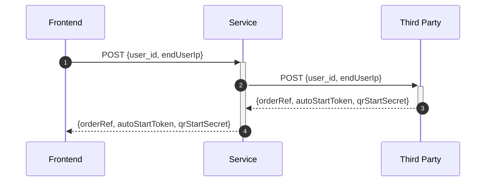

<!-- SHIELDS -->
[![Contributors][contributors-shield]][contributors-url]
[![Forks][forks-shield]][forks-url]
[![Stargazers][stars-shield]][stars-url]
[![Issues][issues-shield]][issues-url]
[![License][license-shield]][license-url]

<p>
  <a href="https://github.com/helsingborg-stad/readme.md">
    
  </a>
</p>
<h1>README.md</h1>
<p>
  README.md boilerplate for helsingborg stad projects.
  <br />
  <a href="https://github.com/helsingborg-stad/readme.md/issues">Report Bug</a>
  ·
  <a href="https://github.com/helsingborg-stad/readme.md/issues">Request Feature</a>
</p>


## Summary
A boilerplate for Helsingborg Stad open source github projects.


## Instructions
- Copy files in this repository into your repository and do a search and replace in the README.md for `readme.md` and replace with `{your repository name}`.
- Keep the header and everything below the License sub header as a footer.
- Put image files referenced in README.md inside `docs/images` folder.
- Make sure the main/master branch is correct in the license-url for the license shield to work correctly.


## Tips
- Avoid creating a "Table of Contents" as it is cumbersome to update and rarely needed in a short descriptive README.md
- Keep it technical if the target audience is developer, less images, more to the "get this up and running fast".


## Examples 
Some examples of good README.md practices.


### Flow diagrams
Use mermaid to describe your API or application flow.



### Code blocks
Use code block when describing install instructions and step by step guides.
```bash
npm install
```

### Requirements
Requirements can be specified in bullet lists.

- NodeJS > 16
- Docker


### Tables
Tables can be good to specify input parameters or env variables.  
Tables can be cumbersome to write manually, consider using an [online generator](https://www.tablesgenerator.com/markdown_tables).

| Parameter name              | Description                                                                  | Required |
|-----------------------------|------------------------------------------------------------------------------|----------|
| deploy-host                 | Host domain or ip                                                            | true     |
| deploy-host-path            | Host deployment path                                                         | true     |
| deploy-host-backup-path     | Host rsync backup path                                                       | true     |
| deploy-host-user            | Host deploy ssh user name                                                    | true     |
| deploy-host-user-key        | Host deploy ssh user key                                                     | true     |
| deploy-host-web-server-user | Host web server user                                                         | true     |
| github-token                | Github token for github npm package usage, use built in secrets.GITHUB_TOKEN | true     |

### File tree
If you need to document a file structure, consider installing shell application [tree](http://mama.indstate.edu/users/ice/tree/) and put the result inside codeblock.

```
.
├── LICENSE
├── README.md
└── docs
    └── images
        └── hbg-github-logo-combo.png
```
Install on MacOS(Requires [HomeBrew](https://docs.brew.sh/Installation))

```bash
brew install tree
```


## License
Distributed under the [MIT License][license-url].


## Acknowledgements
- [othneildrew Best README Template](https://github.com/othneildrew/Best-README-Template)


<!-- MARKDOWN LINKS & IMAGES -->
<!-- https://www.markdownguide.org/basic-syntax/#reference-style-links -->
[contributors-shield]: https://img.shields.io/github/contributors/helsingborg-stad/readme.md.svg?style=flat-square
[contributors-url]: https://github.com/helsingborg-stad/readme.md/graphs/contributors
[forks-shield]: https://img.shields.io/github/forks/helsingborg-stad/readme.md.svg?style=flat-square
[forks-url]: https://github.com/helsingborg-stad/readme.md/network/members
[stars-shield]: https://img.shields.io/github/stars/helsingborg-stad/readme.md.svg?style=flat-square
[stars-url]: https://github.com/helsingborg-stad/readme.md/stargazers
[issues-shield]: https://img.shields.io/github/issues/helsingborg-stad/readme.md.svg?style=flat-square
[issues-url]: https://github.com/helsingborg-stad/readme.md/issues
[license-shield]: https://img.shields.io/github/license/helsingborg-stad/readme.md.svg?style=flat-square
[license-url]: https://raw.githubusercontent.com/helsingborg-stad/readme.md/main/LICENSE
